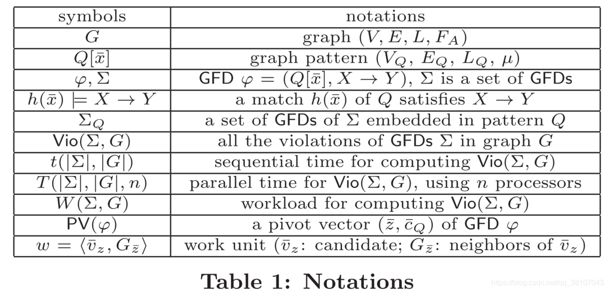
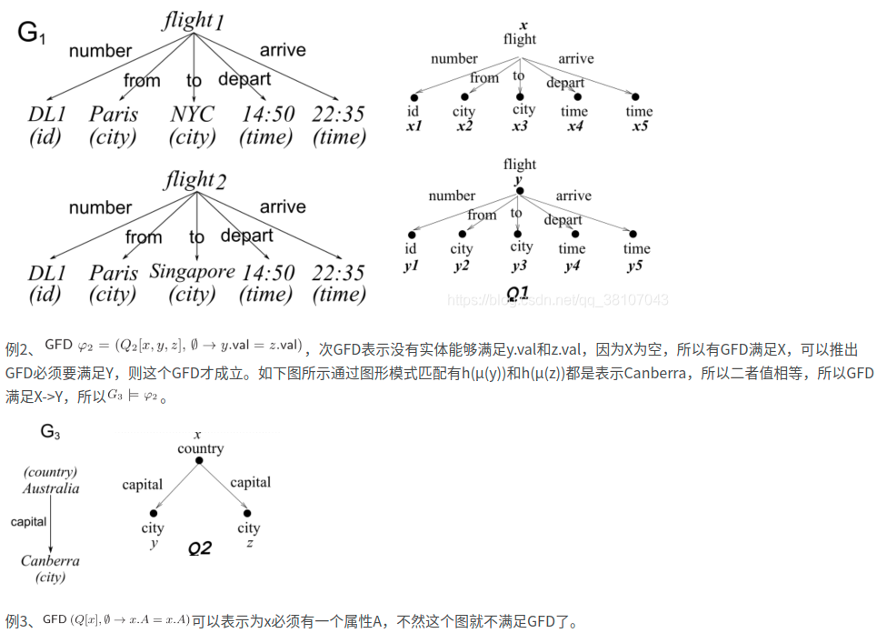
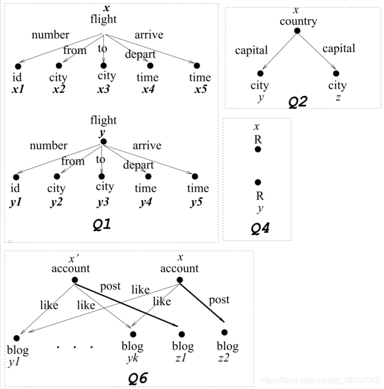
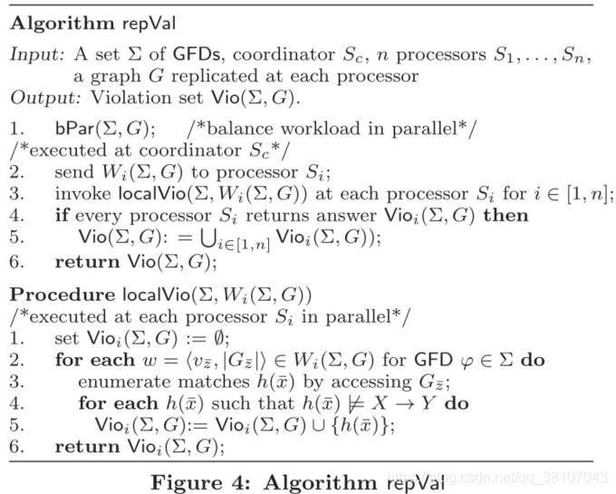

# Functional Dependencies for Graphs 图函数依赖关系

## 简介：

1. 背景：对于常见的数据关系，已经有了很好的数据依赖关系，并且可以扩展为XML，经过修订之后可以有效的捕获关系当中的不一致性
2. 问题：在图表中也明显需要FD（依赖关系）和关系数据库不同的是，在现实生活中图形经常不会拥有架构，FD指定了数据语义中的基本部分，因此对于图来说格外重要，此外
   1. FD可以检查知识库中的不一致性例如：

      （一）航班号为A123的飞机有两个入口但是都是从14:50出发到22:35抵达目的地，但是一架航班是巴黎到纽约，另一架是巴黎到新加坡

      （二）堪培拉和墨尔本都被标记为澳大利亚首都

      （三）鸟类被归类为可以飞行，但是尽管企鹅也是鸟但是不能飞

      宗上我们可以看到在图的依赖关系中的FD可以轻松捕获这不一致的地方

   2. 社会图，当一个博客Z发布了一张照片Y，一个社会公司定义一个状态X有一个附属状态Y，并且要求X中的X.text必须和Y中Y.desc匹配

      （一）Blog:if Z has statues X,Z has photo Y, and if X has attachment Y then X.text = Y.desc

      这本质是图结构数据的函数依赖关系
      
      （二）在捕获垃圾邮件也很有用
      
      如果确认帐户x '为假，则帐户x和x '都类似于博客P 1 ，...，P k，x发布博客y，x '发布y '以及是否y和y '拥有特定的关键字c，则x也被标识为假帐户
   
   

但是，无论多么重要，从公式到经典问题再到应用，对图的FD 的研究仍处于起步阶段。为图定义FD而不是为关系定义FD更具挑战性，因为现实生活中的图是半结构化的，通常没有架构。此外，对于图形中由顶点表示的实体，FD不仅必须指定实体的属性值之间的规律性，而且还必须指定实体的拓扑结构。

3. 解决问题：对于一组GFD ，我们研究它的可满足性，以确定是否存在一个满足Σ中所有GFD的非空图    以及（b）它的含义，以确定Σ是否需要GFD 。我们表明，GFD的可满足性和隐含问题分别是coNP -complete和 NP complete。结果告诉我们，关于GFD的推理并不比它们的关系对应物（如CFD）难，[ CFD ]也很棘手
4. 研究了一个可行的问题：以GFD作为数据质量规则来检测图形中的错误。表明它是CONP -complete决定图表中是否包含没有违反一组的GFDs 。尽管难以处理，仍开发了可并行扩展的算法：即，当使用更多处理器时，它们可以保证花费更少的时间。它们是用于双准则优化问题的2近似算法，以平衡工作量并最小化通信成本。这些使检测大型图形中的错误变得可行。
5. 使用现实生活中的合成图，我们通过实验验证了我们的GFD技术的有效性和效率。我们发现以下内容。（a）在现实生活中，使用GFD进行不一致检测是可行的。对于一组50个GFD ，使用20个处理器的YAGO [44]复制（重新分区）需要156（326次）秒。（b）我们的算法是并行可扩展的：平均为2 。4和3 。当处理器从4增加到20时，在片段化和复制的现实图中分别快7倍。（c）我们的优化技术是有效的：它们将性能提高了1.9倍。（d）GFD在现实生活中捕获各种不一致的图形，从而验证了将拓扑约束和值依赖相结合的必要性。

## 改进

1. （1）我们定义了具有图模式的GFD ，以表达超出RDF的（属性）图的拓扑约束。（2）GFD捕获由模式识别的图结构实体中的不一致。相反，[ 8、12、24 ]的FD都是基于值的，而不管哪个实体携带值，并且[24]的推理技术是基于RDF数据的关系编码的。此外，这些FD不能像CFD中那样用常量（语义值绑定）来表示等式，例如x.city =“ Edi”，而GFD包含CFD 。该函数依赖[10]中的定义为树，并采用关系模式。它们不支持一般的拓扑约束。类似的[23,49]。（3）我们为GFD分析提供了复杂性界限，并为图形中的错误检测提供了并行可扩展算法，而先前的工作并未对此进行研究。
2. 更加接近这项工作的是图形[14]的键上的[14]，在以下方面与GFD不同。（1）键被简单地定义为图形模式Q [ x ]，其中指定的变量x表示实体。与此相反，GFDs具有形式（Q [ˉ X ]中，X → Y），其中ˉ X是变量列表，以及X和Y与在ˉ常量和变量平等原子的连词X。GFDs不能表示为键，就这样的关系文件描述符 不能表示为键。此外，[14]的键被递归地定义，以确定实体，而GFDs是常规的扩展的FD ，并且不递归定义。（2）键在RDF三元组（s，p，o）上定义，而GFD在属性图（例如社交网络）上定义。（3）键是根据三个同构映射来解释的：两个从子图到Q，一个在两个子图之间。相反，GFD 需要从子图到Q的单个同构映射。根据不同的语义，GFD的算法和键完全不同。（4）研究了GFD的可满足性及其含义。这些经典问题并未针对密钥进行研究[14]。
3. 我们的工作与以前的工作有所不同，如下所示。（1）通过支持图形模式的拓扑约束，GFD成为（属性）图上的第一批数据质量规则之一，而不仅限于RDF。（2）GFD旨在在复杂性和表现力之间取得平衡。关于GFD的推理比分析FO公式便宜得多。（3）我们提供了GFD的可满足性和含义的复杂性和特征; 这些是通常关于图依赖关系，尤其是关于图的数据质量规则的推理的第一批结果。（4）我们开发了用于错误检测的并行可扩展算法和用于工作负载分配的新策略，而不是使用昂贵的大规模推理和逻辑编程。这些使错误检测在具有可证明的性能保证的大型图形中变得可行，而这是以前的工作无法提供的。

## 具体算法

1. 与GFD验证算法相关的并行算法是

   （1）用于检测分布式数据中的错误的算法[17，18]，以及

   （2）用于子图枚举，子图同构和SPARQL的算法[5,20,22,25,30,31,39,41,46]。

## 基本定义

1. 常见图标的标签表示：

   

2. 图G = (V, E, L, FA)中，V表示有限的节点集合；E表示有限的边集合；L表示节点和边的标签可分为L(v)和L(e)；FA(v)表示节点的属性与属性值的对应关系；

   图形模式，VQ是模式结点的集合，EQ是模式边的集合；LQ是给节点还有边分配标签的函数；是标量的列表；是参数数量，其等于节点的数量；µ是一个双射函数，将映射到VQ中，或找到节点对应在中对应的变量；使用通配符'_'作为特殊标签

   图形模式匹配：在图G上找到与模型Q同构的子图，这个子图G′= (V′, E′, L′, F′A)；h是一个双射函数用于从节点VQ到节点VQ'的映射；而对于标签有LQ(u) = L′(h(u))，LQ(e) = L′(e') 其中e = (u, u′)，e′= (h(u), h(u′))。当然若 LQ(u)是通配符"_"，则LQ(u) = L′(h(u))总是成立。

   是本文常使用的匹配向量，由h(x)组成。x是变量，是变量的列表。

   图函数依赖：GFDs ϕ = ,其中Q是图形模式，称为ϕ的模型；X和Y是两个的两个字段集合。

   GFD ϕ指定了两个约束条件：1、由模式Q施加的拓扑约束。2、由X → Y指定的属性依赖。 即GFD既要被Q约束也要被函数依赖约束，Q规定了GFD的范围，使得依赖关系X → Y只施加在由Q标识的每个子图中的顶点的属性上

3. 举例说明：

   例1

## 推论

2、关于GFDS的推理
GFDs的可满足性问题
定理1：GFDs的可满足性问题是coNP-complete的

推论2: 定义于有向无环图的常数GFDs，其可满足性问题是coNP-complete的

引理3：当且仅当Σ不冲突时，GFDs集Σ是可满足的。

推论4:如果满足下列条件之一，GFDs的集合Σ总是可满足的:

1、Σ仅由变量GFDs组成

2、Σ不包含形式为的GFDs

GFDs的蕴含问题
定理5、GFDs的蕴含问题是NP-complete的

推论6、当所有的GFDs都被定义为DAG模式，并且它们都没有形式时，仅对于常数GFDs和变量CFDs，蕴含问题是NP-complete。

引理7、对于和一个GFDs集合Σ，有Σ|=ϕ，当且仅当Y可以从Σ和X中扣除.

推论8、用树结构模式定义的GFDs的蕴含问题是PTIME的

## 不一致性检测

命题9、GFDs的验证问题是coNP-complete。

定理10、存在并行可测量的算法，给一个GFDs集合Σ和一个复制到n个处理器的图G，在   并行时间内计算Vio(Σ,G)

定理11、存在并行可测量的算法，给定一个GFDs集合Σ，一个分好了的图G和n个处理器在并行时间内。Vio(Σ, G)在    

 若 则我们说h(x)违反了C，其中GFD 是G根据图模式Q使用h(x)匹配到的一个子图。我们将所有违反的h(x)添加到一个违规集合Vio(Σ, G)里。

而我们所谓的错误检测就是输入一个GFDs集合 Σ和一个图G，会有输出一个违反集合Vio(Σ, G)。我们称这个决策问题为GFDs的验证问题，用于判断是否G |= Σ，当然只有违反集合Vio(Σ, G)为空时，G |= Σ。

## 三个算法

### 顺序算法
此算法使用了一个GFDs集合Σ，一个图G，一个单处理器来计算违反集合Vio(Σ, G)。我们称这个算法为detVio

​        执行如下：

​		刚开始时Vio(Σ, G) = ∅。枚举G中的模式Q中的所有h(x)，检查是否存在即h(x)!=x->y是否存在，若违反了就添加到Vio(Σ, G)。

​		这种算法非常简单，执行起来的时间复杂度非常非常得高，所以对于大图来说是禁止的。

### 并行算法的介绍
以上算法复杂度这么高，因此我们提出了一个用于解决此问题的并行算法，也就是复制图的并行算法和碎片图的并行算法

 首先介绍一下新的符号和概念：

W(Σ, G)表示工作量，是算法计算所有违反集合Vio(Σ, G)所需要的消耗

t(|Σ|,|G|)表示最好的顺序算法在计算Vio(Σ, G)所消耗的时间

T(|Σ|,|G|, n)表示使用n个处理器通过并行算法来计算Vio(Σ, G)所使用的时间

​			σ 是一个一对一的映射，从Z映射到G中的节点，Z就是上面介绍的轴向量；O(zi)和U(zi)是不一样的，前者表示G中的节点，后者表示Q中的节点，O(zi)是Q(zi)的候选，是对应的分享相同的标签

### 复制图的并行算法

命题12: 1、负载平衡问题是NP-complete的。2、给定Σ, n和W(Σ, G)，在O(n|W(Σ, G)| + |W(Σ, G)| log|W(Σ, G)|) 时间内有一个2-近似算法来寻找平衡的工作负载分区

此算法先将图G复制到每一个处理器上，我们所要做的就是将工作量均匀的分配到每一个处理器上。

算法名称为repVal，由一个协调器和n个处理器组成。协调器上运行了一个程序bPar，处理器上并行地运行了程序localVio，运行过程为：

bPar是进行工作量均匀分配方式：

localVio的工作方式：

### 碎片图的算法

此算法论文没有举例，以后遇到再补充对此算法的使用简介，此处只说了一些定义

dispart工作方式：

## 结论

这项工作是迈向图依赖理论的第一步。我们提出了GFD ，为其经典问题建立了复杂性界限，并为其应用提供了并行可扩展算法。我们的实验结果证明了GFD技术的有效性。
未来工作的主题之一是为现实图形中的GFD发现开发有效的算法。另一个问题是，提供一个健全和完整的公理系统GFDs ，沿着相同的路线作为阿姆斯特朗的公理关系的FD [3]。第三个主题是在存在常见于知识库中的类型和其他语义约束的情况下，重新研究GFD的可满足性和隐含性问题。

